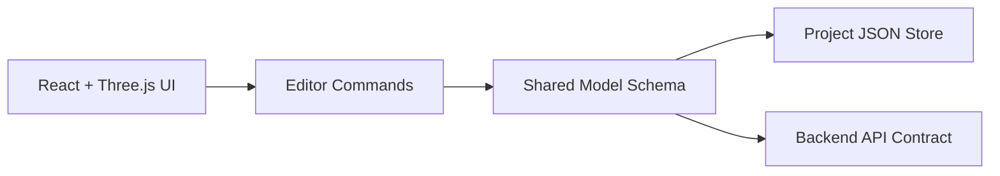

# Sprint 001 Technical Plan

## Architecture
- Frontend app renders scene and handles interaction.
- Backend service boundary defined for future analysis integration.
- Shared model schema package used by both frontend and backend.

## Components
- `ui/viewport`: camera, scene graph, selection overlays
- `ui/editor`: create/move/delete commands for nodes/members
- `model/schema`: Node, Member, Panel, Load definitions + validators
- `model/io`: import/export JSON round-trip

## Data Rules
- Internal units are metric.
- Node IDs are unique and stable.
- Member endpoints must reference existing node IDs.
- Validation failures return actionable error messages.

## Test Strategy
- Unit tests: schema validation, ID rules, member-node integrity checks.
- Integration tests: edit operations mutate model and persist correctly.
- UI smoke test: viewport loads and renders sample model.

## Open Questions
None for Sprint 001.
