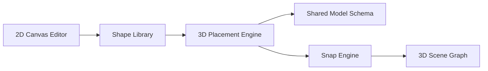

# Sprint 002 Technical Plan

## Architecture Overview

The 2D editor operates in its own coordinate space. Shapes are stored as named collections of local-space nodes and members. The placement engine transforms shapes into world coordinates, aligns snap edges to target geometry, and merges coincident nodes into the main model.

## Component Design

### Component: 2D Canvas Editor (`ui/editor-2d`)

**Use Cases**: SUC-004, SUC-005

Drawing surface with tools for placing nodes, drawing line segments, selecting/moving/deleting entities. Snapping system handles grid, node, midpoint, perpendicular, and parallel alignment.

Key interfaces:
- `drawSegment(start, end)` — creates a member between two points
- `snapPoint(cursor)` — returns the best snap target for the cursor position
- `loadTemplate(templateId)` — populates canvas from a built-in template

### Component: Shape Library (`model/shapes`)

**Use Cases**: SUC-004, SUC-005

Data structure: `{id, name, nodes: [{id, x, y}], members: [{id, startNode, endNode, isSnapEdge}]}`. Stored in `project.shapes[]`. CRUD operations for shapes.

### Component: Truss Templates (`ui/editor-2d/templates`)

**Use Cases**: SUC-005

Built-in definitions for Pratt, Howe, Warren, and scissors trusses with configurable span and depth. Each template is a function that generates a shape definition.

### Component: 3D Placement Engine (`ui/placement`)

**Use Cases**: SUC-006

Transforms shape local coordinates to world coordinates based on snap edge alignment. Handles snap edge to target geometry alignment (position + rotation), perpendicular orientation, sliding along target edge, and equal-spacing mode.

### Component: Node Merge (`model/merge`)

**Use Cases**: SUC-006

After placement, scans new nodes against existing model nodes. Nodes within 1mm (0.001m) tolerance are consolidated: the new node is discarded and its member references updated to the existing node.

## Data Rules

- Shapes stored in `project.shapes[]` with unique ID and local-space geometry.
- Snap edges tagged with `isSnapEdge: true` on the member within the shape.
- On placement, local coordinates transformed to world coordinates.
- Node merge tolerance: 1mm (0.001m). Earlier-created node wins.
- Placed members reference merged node IDs.

## Open Questions

- Canvas vs SVG for the 2D editor? Canvas for drawing performance, SVG for easier hit-testing. Decide during implementation.
- Should shapes support parametric resize? Defer to future sprint if needed.
