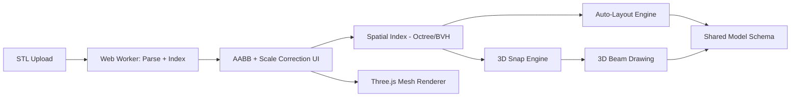

# Sprint 004 Technical Plan

## Architecture Overview

STL processing happens entirely in a web worker. The worker parses the file, extracts unique vertices and edges, optionally simplifies the mesh, builds a spatial index, and returns both the renderable mesh data and the index to the main thread. Before the STL is committed to the scene, the user sees an AABB dimensions overlay and can correct the scale.

## Component Design

### Component: STL Parser (`stl/parser`)

**Use Cases**: SUC-007

Handles binary and ASCII STL formats. Extracts triangle list, deduplicates vertices (0.1mm tolerance), derives edges from triangle adjacency. Applies mesh simplification if triangle count exceeds target. Rejects meshes above 100k triangles after simplification.

### Component: Scale Correction (`stl/scale-correction`)

**Use Cases**: SUC-007

Computes the axis-aligned bounding box (AABB) from parsed mesh vertices and returns X/Y/Z extents. Provides a `computeScaleFactor(knownAxis, knownValue)` function that returns a uniform scale factor. For non-uniform scaling, accepts per-axis overrides. The scale factor is applied to all vertex positions before spatial index construction and rendering. The factor is stored in the project's STL reference record so it persists across save/load.

UI: A modal/overlay shown after import displaying the three extents in project display units. The user can edit any dimension; on change, the uniform scale factor is recomputed and a scaled preview is shown. Confirm commits the scale; cancel discards the import.

### Component: Spatial Index (`stl/spatial-index`)

**Use Cases**: SUC-007, SUC-008

Octree or BVH over STL vertices, edges, and faces. Key queries:
- `nearestVertex(point, maxDist)` — closest vertex
- `nearestEdgePoint(point, maxDist)` — closest point on any edge
- `nearestFacePoint(point, maxDist)` — closest point on any face
- `getFacesInRegion(bbox)` — faces intersecting a bounding box

### Component: STL Renderer (`stl/renderer`)

**Use Cases**: SUC-007

Three.js mesh with adjustable transparency (default 0.3 opacity). Toggle visibility via UI control. Does not participate in raycasting for structural entity selection.

### Component: 3D Snap Engine (`ui/snap-3d`)

**Use Cases**: SUC-008

Unified snap engine querying multiple sources in priority order:
1. Existing model nodes (exact match within tolerance)
2. STL vertices
3. STL edge points
4. Existing model member midpoints
5. STL face points
6. Grid intersections

Returns the best snap result with type indicator for visual feedback.

### Component: Auto-Layout Engine (`autolayout/engine`)

**Use Cases**: SUC-009

Takes selected STL face IDs, computes bounding rectangle in the face plane, generates beam positions at user-specified spacing. Supports stud pattern (vertical beams + top/bottom plates) and joist pattern (parallel spanning beams). Outputs Node/Member creation commands.

## Data Rules

- STL stored in project as file reference or base64-encoded geometry.
- STL reference record includes: filename, scale factor (uniform or per-axis), AABB extents (post-scale), and visibility/opacity settings.
- Scale factor defaults to 1.0. Applied to all vertices before indexing and rendering.
- Spatial index rebuilt on load (not serialized). Rebuilt after scale correction.
- Triangle limit: 100k. Reject above with guidance to simplify externally.
- Mesh simplification merges vertices within 0.1mm, collapses edges < 1mm.
- Auto-layout respects 1mm node merge tolerance from Sprint 002.

## Open Questions

- Octree vs BVH? BVH handles irregular meshes better. Profile during implementation.
- STL storage: base64 in JSON vs file reference? Support both, default to file reference for large meshes.
