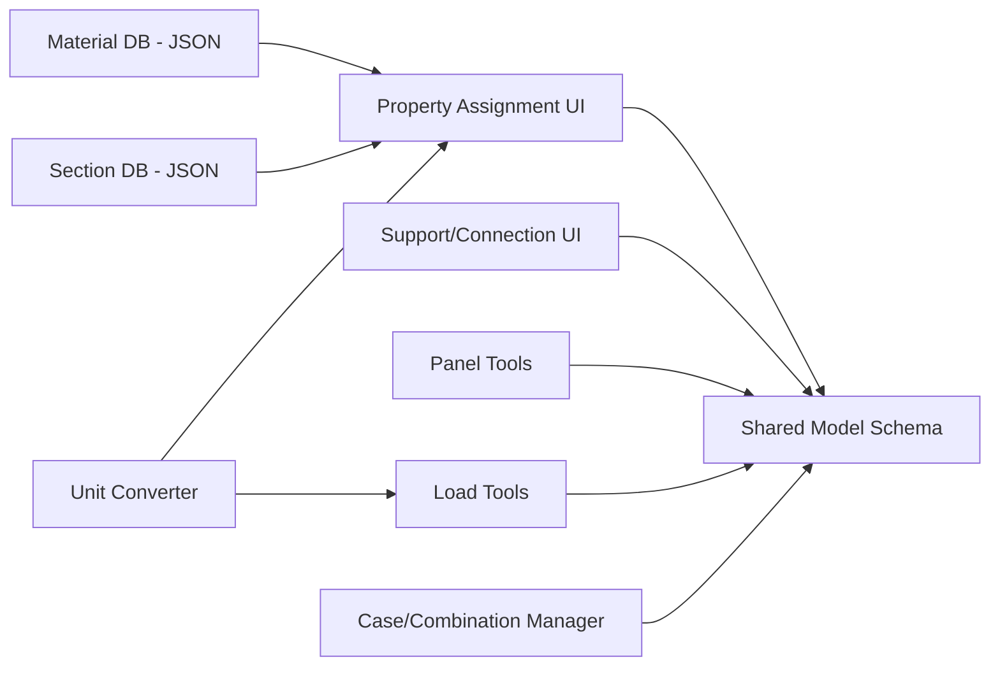

# Sprint 005 Technical Plan

## Architecture Overview

This sprint adds the "engineering" layer on top of geometry from Sprints 001-003. All property data flows into the shared model schema. Material and section databases are static JSON bundled with the frontend. Unit conversion happens at the UI boundary — internal storage is always metric.

## Component Design

### Component: Material Database (`data/materials.json`)

**Use Cases**: SUC-010

Static JSON with entries for common structural materials. Each entry: `{id, name, category, E, G, density, yield_strength}`. Categories: structural_steel, lumber, aluminum, concrete. Approximately 20-30 entries covering the most common grades and species.

### Component: Section Database (`data/sections.json`)

**Use Cases**: SUC-010

Static JSON with entries for common cross-sections. Each entry: `{id, name, category, A, Ix, Iy, Sx, Sy, J, dimensions}`. Categories: w_shapes, hss, channels, angles, lumber_nominal, pipe. Approximately 20-30 of the most common sizes per category.

### Component: Property Assignment UI (`ui/properties-panel`)

**Use Cases**: SUC-010

Searchable dropdown for material and section selection. Custom entry form with validation. Multi-select support — apply to all selected members at once.

### Component: Support/Connection Panel (`ui/support-panel`)

**Use Cases**: SUC-011

Node property editor: support type dropdown, spring stiffness inputs (6 DOF), connection type, connection method metadata. Visual indicator mapping (triangle=pinned, square=fixed, etc.) updates the 3D viewport.

### Component: Panel Tools (`ui/panels`)

**Use Cases**: SUC-012

Two sub-tools:
- Closed-loop: sequential node clicking, coplanarity check (10mm tolerance via SVD best-fit plane), loop closure detection.
- Select-and-sheet: boundary detection from selected beams (find outer cycle), coplanarity check, panel generation.

### Component: Load Tools (`ui/loads`)

**Use Cases**: SUC-013

Sub-tools for point, distributed, and area loads. Each captures magnitude, direction (preset dropdown + custom vector input), and load case assignment. Self-weight toggle computes `density * A * length * g` per member as distributed gravity load.

### Component: Load Case Manager (`ui/load-cases`)

**Use Cases**: SUC-014

CRUD for named load cases. Combination editor: add cases with factors. Viewport filter to show/hide loads by case.

### Component: Unit Converter (`model/units`)

**Use Cases**: SUC-010, SUC-013

Dual-value storage: `{value: 8, unit: "ft", metric: 2.4384}`. Conversion functions for length, force, pressure, density. Display formatter respects project unit preference.

### Component: End Release Computation (`model/end-releases`)

**Use Cases**: SUC-011

At analysis time, derives member end releases from node connection types. Pinned connection releases moment DOFs (mx, my, mz) for all members at that node. Semi-rigid applies partial stiffness.

## Data Rules

- Materials: name, E (Pa), G (Pa), density (kg/m3), yield_strength (Pa).
- Sections: name, A (m2), Ix (m4), Iy (m4), Sx (m3), Sy (m3), J (m4).
- Imperial values: `{value, unit, metric}` for lossless round-trip.
- Panel coplanarity tolerance: 10mm.
- Combinations: `[{case: "Dead", factor: 1.2}, {case: "Live", factor: 1.6}]`.
- Self-weight: `density * A * length * 9.81` as distributed gravity load.

## Open Questions

- How many W-shapes and lumber sizes for V1? Start with 20-30 most common each; expand later.
- Should custom sections invoke `sectionproperties` on the backend? Defer to Sprint 006.
