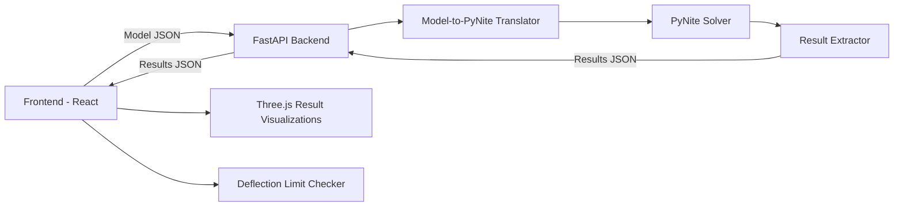

# Sprint 006 Technical Plan

## Architecture Overview

The backend is stateless: receives complete model JSON, constructs a PyNite model, runs analysis, samples results, and returns everything in a single response. Frontend caches results and renders overlays in Three.js.

## Component Design

### Component: Analysis API Endpoint (`backend/api/analyze`)

**Use Cases**: SUC-015

FastAPI POST endpoint. Accepts model JSON, returns results JSON. Validates input schema before translation. Returns structured errors for invalid models. Supports `analysis_type` parameter: `"linear"` (default) or `"p_delta"`.

### Component: Model-to-PyNite Translator (`backend/translator`)

**Use Cases**: SUC-015

Maps project model entities to PyNite API calls:
- Nodes -> `FEModel3D.add_node()` with support conditions
- Members -> `FEModel3D.add_member()` with material/section properties and end releases
- Loads -> `add_member_pt_load()`, `add_member_dist_load()`, etc.
- Load combinations -> `add_load_combo()`

Validates all references (member endpoints exist, etc.).

### Component: Result Extractor (`backend/extractor`)

**Use Cases**: SUC-015, SUC-016

After analysis, samples results at 21 evenly spaced stations (0.0 to 1.0) per member: displacements, internal forces (M, V, N, T). Extracts node displacements, rotations, and reactions. Computes envelope (max/min across all combinations).

### Component: Deflected Shape Visualization (`ui/results/deflected-shape`)

**Use Cases**: SUC-016

Three.js overlay: displaces wireframe by sampled displacements multiplied by user-adjustable exaggeration factor. Color gradient maps displacement magnitude.

### Component: Force Diagram Visualization (`ui/results/force-diagrams`)

**Use Cases**: SUC-016

Renders M, V, N diagrams as ribbon geometry along each member from 21 sampled stations. Axial force: red=compression, blue=tension. Tooltips show values at hover position.

### Component: Reaction Visualization (`ui/results/reactions`)

**Use Cases**: SUC-016

Arrow geometry at support nodes proportional to force magnitude. Numeric labels. Separate arrows per force/moment component.

### Component: Deflection Limit Checker (`ui/results/limit-checker`)

**Use Cases**: SUC-017

Configuration UI for limits: global default (e.g., L/240) and per-tag overrides. Evaluation: `max_deflection > member_length / limit_ratio` flags the member. Red highlighting in viewport and summary table.

### Component: Case/Combination Selector (`ui/results/case-selector`)

**Use Cases**: SUC-016

Dropdown for load case/combination selection. "Envelope" option shows max/min across all combinations.

## Data Rules

- Results JSON: `{nodes: [{id, dx, dy, dz, rx, ry, rz}], members: [{id, stations: [{pos, Mx, My, Vx, Vy, N, T, dx, dy, dz}]}], reactions: [{node_id, Fx, Fy, Fz, Mx, My, Mz}]}`.
- 21 stations per member (0.00, 0.05, ..., 1.00).
- Envelope computed server-side across all combinations.
- Frontend caches results keyed by model content hash.
- Deflection limits: `{default_ratio: 240, overrides: [{tag: "floor", ratio: 360}]}`.

## Open Questions

- Single response vs streaming? Start with single response; switch if large models timeout.
- Panels in PyNite analysis? Only if PyNite supports plate elements natively. Otherwise distribute area loads to supporting beams via tributary area.
