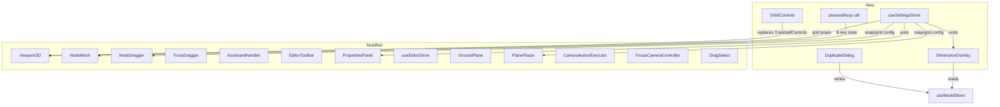

# Sprint 006 Technical Plan

## Architecture Overview

This sprint is a UX-focused refactor of the 3D viewport. It replaces the
orbit controls, simplifies the mode system, centralizes hardcoded settings
into a store, and adds several new interaction patterns (B+click beam,
duplicate-with-offset, dimension overlay). Most changes are in the React/R3F
component layer; the Zustand model store is unchanged.



## Component Design

### Component: useSettingsStore (`store/useSettingsStore.ts`)

**Use Cases**: SUC-006-03
**Tickets**: 003, 004

New Zustand store with `persist` middleware (localStorage key
`structview-settings`).

```ts
interface SettingsState {
  unitSystem: 'imperial' | 'metric'
  snapGridSize: number       // world units (default: 1 for imperial ≈ 1 ft)
  gridLineSpacing: number    // world units (default: 5)
  workPlaneSize: number      // world units (default: 20)
  snapEnabled: boolean       // default: true
  // actions
  setUnitSystem: (u: 'imperial' | 'metric') => void
  setSnapGridSize: (s: number) => void
  setGridLineSpacing: (s: number) => void
  setWorkPlaneSize: (s: number) => void
  setSnapEnabled: (b: boolean) => void
}
```

Consumers that replace hardcoded constants:

| Current constant | File(s) | Replaced by |
|------------------|---------|-------------|
| `GRID_SIZE = 1.0` | NodeDragger, PlanePlacer, GroundPlane | `snapGridSize` |
| `SNAP_RADIUS = 0.5` | NodeDragger, PlanePlacer, GroundPlane, SnapIndicators, TrussDragger | `snapGridSize / 2` |
| `cellSize={1}` | Viewport3D Grid | `snapGridSize` |
| `sectionSize={5}` | Viewport3D Grid | `gridLineSpacing` |
| `GRID_SIZE=20, GRID_DIVISIONS=20` | PlaneGrid | `workPlaneSize`, derived divisions |

### Component: SettingsPanel (`components/SettingsPanel.tsx`)

**Use Cases**: SUC-006-03
**Tickets**: 004

New sidebar panel (or popover) triggered by a gear icon. Contains:
- Imperial / metric toggle
- Snap grid size number input
- Grid line spacing number input
- Work plane size number input

All inputs write directly to `useSettingsStore`. No save button — changes are
immediate and auto-persisted.

### Component: Turntable Orbit Controls

**Use Cases**: SUC-006-07
**Tickets**: 008

Replace `TrackballControls` from `@react-three/drei` with `OrbitControls`.
OrbitControls natively constrains rotation to azimuth (around Y by default)
and polar angle, which gives turntable behavior. Since the app is Z-up, set:

```ts
<OrbitControls
  makeDefault
  enableDamping={false}
  mouseButtons={{ LEFT: -1, MIDDLE: THREE.MOUSE.DOLLY, RIGHT: THREE.MOUSE.ROTATE }}
/>
```

With a configurator that swaps right-click to PAN when Shift is held (same
pattern as current `TrackballControlsConfigurator`).

**Migration impact on other components:**

| Component | Current API | OrbitControls equivalent |
|-----------|-------------|--------------------------|
| CameraActionExecutor | `controls.target`, `controls.enabled`, `controls.update()` | Same API |
| FocusCameraController | `controls.noRotate = true` | `controls.enableRotate = false` |
| DragSelect | `controls.enabled` | Same API |

drei's `OrbitControls` respects `camera.up`, so setting `up: [0,0,1]` on the
Canvas camera (already done in Viewport3D line 89) should make azimuth rotate
around Z automatically.

### Component: ViewCube Z-up Alignment

**Use Cases**: SUC-006-08
**Tickets**: 009

The ViewCube's `FACE_VIEW_DIRS` and labels already assume Z-up. The main work
is verifying that drei's `GizmoHelper` (which wraps ViewCube) renders correctly
after switching to OrbitControls with Z-up. The GizmoHelper creates a secondary
scene/camera — if it defaults to Y-up internally, the cube orientation will be
wrong and needs explicit `up` configuration.

CameraActionExecutor already sets correct up vectors for face views (Z-up for
side views, Y-up for top/bottom). This should remain compatible.

### Component: Fix Node Drag Projection

**Use Cases**: SUC-006-04
**Tickets**: 005

**Root cause**: `NodeDragger.tsx` and `TrussDragger.tsx` compute NDC by
dividing mouse position by `window.innerWidth/Height` instead of the canvas
container dimensions. When the sidebar is visible, the projection is wrong and
the node drifts.

**Fix**: Use R3F's `useThree((s) => s.gl.domElement)` to get the canvas
element, then compute NDC relative to its `getBoundingClientRect()`. Or better,
use the pointer event's built-in ray from `e.ray` if available.

Apply the same fix in `TrussDragger.tsx`.

### Component: Unify Select and Move Modes

**Use Cases**: SUC-006-05
**Tickets**: 006

Remove `'move'` from `EditorMode`. In the unified select mode:
- Click selects (existing behavior)
- Drag on a selected node starts a move (currently only happens in move mode)

Changes:
- `useEditorStore.ts`: Remove `'move'` from EditorMode type
- `EditorToolbar.tsx`: Remove Move button from TOOLS array
- `NodeMesh.tsx`: Change `handlePointerDown` — set `dragNodeId` when dragging
  a selected node in select mode (not just in move mode)
- `KeyboardHandler.tsx`: Remove `g: 'move'` from MODE_KEYS
- `SnapIndicators.tsx`, `RotateArc.tsx`, `TrussDragger.tsx`: Update mode checks

### Component: Remove Add-Node Mode

**Use Cases**: SUC-006-06
**Tickets**: 007

Remove `'add-node'` from `EditorMode`. The N key becomes a direct action:

- `KeyboardHandler.tsx`: N key no longer switches mode. Instead, it reads the
  current cursor position (needs a shared cursor-position ref, or raycast on
  demand), projects onto the active plane, snaps to grid, creates a node, and
  selects it.
- Need a way to know the cursor's 3D position at keypress time. Options:
  - Track `hoverPosition` in a store/ref updated by pointer-move on
    GroundPlane/PlanePlacer
  - Raycast from the last known mouse NDC on demand
- `EditorToolbar.tsx`: Remove Add Node button
- `GroundPlane.tsx`, `PlanePlacer.tsx`: Remove `mode === 'add-node'` checks

### Component: Editable Coordinate Fields

**Use Cases**: SUC-006-01
**Tickets**: 001

The `PropertiesPanel.tsx` `CoordField` component already supports click-to-edit
and Enter-to-commit. Changes needed:

- **Select-all on focus**: Add a ref to the input, call `inputRef.select()`
  after the autoFocus triggers
- **Tab/Return to advance**: Add an `onAdvance` callback prop. When Enter or
  Tab is pressed, commit the value and call `onAdvance()`. The parent
  `PropertiesPanel` manages a `focusIndex` state (0=X, 1=Y, 2=Z) and passes
  it down to auto-focus the right field.

### Component: Relative Expression Editing

**Use Cases**: SUC-006-02
**Tickets**: 002

`parseCoordinateInput` in `PropertiesPanel.tsx` already handles `+N` and `-N`
relative syntax. The UX changes are:

- Click highlights entire value (covered by ticket 001's select-all)
- Left arrow un-highlights and moves cursor to end (this is default browser
  behavior for a selected input — left arrow collapses selection to the end)
- User appends `+3` — the existing parser handles this

Minimal code changes beyond ticket 001. May need to clarify the `-5` ambiguity:
is it "set to -5" or "subtract 5"? Current code treats leading `-` as relative
if the field already has a value. This may need a convention change (e.g., only
`+` prefix is relative; bare `-5` is absolute).

### Component: B+Click Beam Shortcut

**Use Cases**: SUC-006-09
**Tickets**: 010

Create a lightweight `pressedKeys` utility (`utils/pressedKeys.ts`) — a
module-level `Set<string>` tracking held keys via window keydown/keyup/blur
listeners. No store, no re-renders.

In `NodeMesh.tsx`, add a check at the top of the select-mode click handler:
if `pressedKeys.has('b')` and exactly one node is selected and the clicked
node is different, create a beam and advance selection.

### Component: Duplicate with Offset

**Use Cases**: SUC-006-10
**Tickets**: 011

New `DuplicateDialog` component. Triggered by a toolbar button or keyboard
shortcut (e.g., Ctrl+D or a dedicated key).

Logic:
1. Read selected node IDs and member IDs from `useEditorStore`
2. For each selected node, create a clone at `position + offset`
3. Build a mapping from old node ID → new node ID
4. For each member whose **both** endpoints are in the selected set, create a
   clone referencing the new node IDs
5. If a group is selected, create a new group containing the cloned entities
6. Add all new entities to `useModelStore`
7. Select the new entities, deselect the originals

### Component: Dimension Overlay (Experimental)

**Use Cases**: SUC-006-11
**Tickets**: 012

New `DimensionOverlay` component rendered inside the R3F Canvas. Uses drei's
`Html` or `Billboard` + `Text` for labels that face the camera.

- **Beam labels**: Positioned at the midpoint of each member. Text shows the
  Euclidean distance between start and end nodes, formatted with current units.
- **Node labels**: Positioned near each node. Text shows `(x, y, z)` formatted
  with current units.
- **Editable**: Clicking a label renders an `Html`-wrapped `<input>` at that
  3D position. On commit, updates the model store.

Toggle state: Add `showDimensions: boolean` to `useEditorStore` (or a new
UI store).

## Data Flow

```
Settings Change:
  User edits setting in SettingsPanel
  → useSettingsStore updates + persists
  → Grid/snap consumers re-render with new values

Turntable Orbit:
  Right-click drag → OrbitControls handles azimuth/elevation
  → Camera position updates, Z-up maintained
  → ViewCube secondary scene stays in sync

Unified Select+Move:
  Click node → select (useEditorStore.select)
  Drag selected node → NodeDragger activates
  → pointerMove projects onto plane → updateNode

B+Click Beam:
  pressedKeys tracks 'b' held
  → NodeMesh click checks pressedKeys.has('b') + single selection
  → createMember(selectedId, clickedId)
  → select(clickedId) for chaining

Duplicate with Offset:
  User triggers duplicate → DuplicateDialog opens
  → User enters offset → confirm
  → Clone nodes at offset, clone enclosed members
  → Add to model store, select clones

Dimension Overlay:
  Toggle on → DimensionOverlay renders
  → Reads all nodes/members from useModelStore
  → Computes beam lengths, formats positions
  → Renders billboard Text at each position
  → Click label → inline Html input → commit → updateNode/noop
```

## Open Questions

- Should the settings panel be a sidebar tab, a popover from a gear icon, or a
  modal dialog? (Recommendation: popover from gear icon in the toolbar area)
- For the N-key node placement, how to get the cursor's 3D position at keypress
  time? (Recommendation: track `hoverWorldPosition` via pointer-move events on
  the ground/plane surfaces, stored in a ref)
- Should `-5` in a coordinate field be absolute or relative?
  (Recommendation: bare `-5` is absolute; only `+` prefix is explicitly relative.
  To subtract, user types the cursor to end and appends `-5` which becomes
  `12.5-5` = `7.5`)
