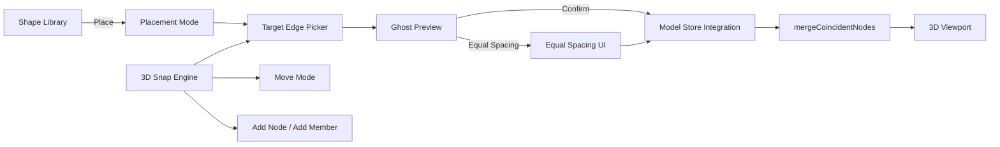

# Sprint 007 (002A) Technical Plan

## Architecture Overview

This sprint builds the UI layer that connects the Sprint 002 pure functions (placeShape, mergeNodes, equalSpacing) to the model store and 3D viewport. It also adds 3D snapping and move functionality.

## Component Design

### Component: Placement Mode Controller (`store/usePlacementStore`)

**Use Cases**: SUC-004, SUC-005

A Zustand store managing the multi-step placement workflow:
- `phase`: 'idle' | 'picking-edge' | 'previewing' | 'adjusting'
- `shapeId`: the shape being placed
- `targetEdge`: { start: Vec3, end: Vec3 } | null
- `offset`: 0..1 slider value
- `count`: number of copies (1 = single, >1 = equal spacing)
- `commit()`: runs placeShape/placeEqualSpacing + mergeCoincidentNodes + adds to model store
- `cancel()`: resets to idle

### Component: Target Edge Picker (`components/TargetEdgePicker`)

**Use Cases**: SUC-004

A Three.js overlay active during the 'picking-edge' phase:
- First click sets `targetEdge.start` (snapped via 3D snap engine)
- Second click sets `targetEdge.end` (snapped)
- Alternatively, clicking an existing member uses its start/end node positions
- Visual: highlighted line segment between the two picked points

### Component: Placement Preview (`components/PlacementPreview`)

**Use Cases**: SUC-004, SUC-005

A Three.js group rendered during the 'previewing'/'adjusting' phase:
- Computes placed node positions using placeShape (or placeEqualSpacing for count > 1)
- Renders as semi-transparent wireframe (not in the model store)
- Updates reactively when offset or count changes
- Nodes as small translucent spheres, members as translucent tubes

### Component: Placement Panel (`components/PlacementPanel`)

**Use Cases**: SUC-004, SUC-005

An overlay panel visible during placement mode:
- Offset slider (0 to 1)
- Count input (number spinner, default 1)
- "Confirm" and "Cancel" buttons
- Shows the shape name being placed

### Component: 3D Snap Engine (`editor3d/snap3d`)

**Use Cases**: SUC-010, SUC-011

Pure function similar to the 2D snap engine but operating in 3D:
- `snapPoint3D(cursor: Vec3, nodes: Node[], members: Member[], options: Snap3DOptions): Snap3DResult`
- Priority: existing node > member midpoint > grid intersection
- Returns snapped position, snap type, and source ID
- Options: snapRadius (world units), gridSize
- Used by: TargetEdgePicker, GroundPlane (add node), NodeMesh (add member), Move mode

### Component: 3D Snap Indicator (`components/SnapIndicator3D`)

**Use Cases**: SUC-011

Visual feedback for 3D snapping:
- Glowing ring or sphere at the snap target position
- Color-coded by snap type (blue=node, green=midpoint, gray=grid)
- Visible only when a snap is active

### Component: Move Mode (`components/NodeMesh` enhancement)

**Use Cases**: SUC-010

Enhance NodeMesh to support drag in Move mode:
- When mode is 'move' and a node is clicked, attach TransformControls (from @react-three/drei) or custom pointer drag handlers
- During drag: update node position via updateNode, snap to 3D grid
- On release: finalize position in store
- Connected members update reactively (already the case since members reference node IDs)

### Component: Multi-Shape Editor (`components/ShapeLibrary` enhancement)

**Use Cases**: SUC-006

Enhance ShapeLibrary to support:
- "Load" action that populates the 2D editor with the shape's nodes/members
- Track which shape is currently loaded (editingShapeId in editor store)
- "Save" updates the existing shape in the model store
- "New" clears the canvas and resets editingShapeId
- Dirty tracking: prompt if unsaved changes exist when switching

## Data Rules

- Placement mode is ephemeral UI state — not persisted in the project.
- Ghost preview is computed on every offset/count change but NOT stored in the model.
- Only on commit are nodes/members added to the model store.
- 3D snap uses the same 1mm tolerance as 2D snap for node matching.
- The 3D snap engine operates in world coordinates (meters).

## Open Questions

- TransformControls vs custom drag handlers for Move mode? TransformControls is easier to implement but adds visual clutter. Start with TransformControls, simplify later if needed.
- Should the target edge picker support clicking on the ground plane (for new edges not aligned to existing geometry)? Yes — needed for the first placement when no model exists yet.
