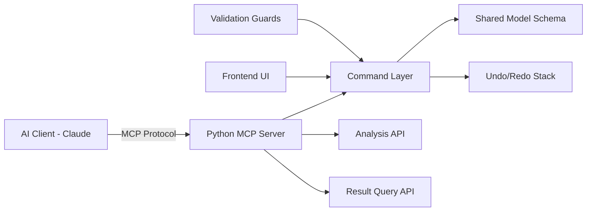

# Sprint 007 Technical Plan

## Architecture Overview

The MCP server wraps the same command layer used by the frontend UI. Every mutation goes through the command layer, which records it on the undo/redo stack and validates against guards before applying.

## Component Design

### Component: MCP Server (`mcp/server`)

**Use Cases**: SUC-018, SUC-021

Python MCP server using the MCP SDK. Per-project endpoint routing. Tool registration from typed Python functions with auto-generated schemas.

### Component: Geometry Tools (`mcp/tools/geometry`)

**Use Cases**: SUC-018

Tools: `list_nodes`, `list_members`, `add_node`, `add_member`, `remove_node`, `remove_member`, `move_node`, `place_shape`, `auto_layout`, `mirror`, `copy`, `array_along_edge`. Each validates inputs, creates a Command, executes it, returns structured response.

### Component: Property Tools (`mcp/tools/properties`)

**Use Cases**: SUC-018

Tools: `set_material`, `set_section`, `set_support`, `set_connection`. Accept member/node IDs and property values. Look up database entries by name or accept custom definitions.

### Component: Load Tools (`mcp/tools/loads`)

**Use Cases**: SUC-018

Tools: `apply_point_load`, `apply_distributed_load`, `apply_area_load`, `toggle_self_weight`, `define_load_case`, `define_combination`. Each validates target entity existence.

### Component: Analysis Tools (`mcp/tools/analysis`)

**Use Cases**: SUC-021

Tools: `trigger_analysis`, `get_max_deflection`, `get_critical_members`, `get_reactions`, `check_limits`. `trigger_analysis` calls the same backend as the UI. Query tools filter cached results.

### Component: Command Stack (`commands/stack`)

**Use Cases**: SUC-019

Bounded stack (100 entries). API: `execute(cmd)`, `undo()`, `redo()`. New commands after undo discard redo history. Shared between UI and MCP.

### Component: Command Types (`commands/types`)

**Use Cases**: SUC-019

One Command class per mutation type: `AddNodeCommand`, `RemoveNodeCommand`, `MoveNodeCommand`, `AddMemberCommand`, `SetMaterialCommand`, `ApplyLoadCommand`, etc. Each implements `execute()` and `undo()`.

### Component: Validation Guards (`guards/`)

**Use Cases**: SUC-020

- `guards/panels`: Coplanarity check (10mm tolerance). Rejects non-planar panels.
- `guards/stl`: Triangle count limit (100k). Rejects over-complex imports.
- `guards/analysis`: Pre-analysis validation — supports, materials, sections, connectivity.

## Data Rules

- Every mutation wrapped in a Command before execution.
- Command stack shared between UI and MCP.
- MCP tools return `{success: bool, data?: any, error?: string}`.
- Per-project MCP: `localhost:<port>/projects/<project_id>`.
- Guard failures return errors without modifying model state.

## Open Questions

- MCP deployment: embedded in FastAPI vs separate process? Start embedded.
- Real-time sync: WebSocket push vs polling? WebSocket preferred.
